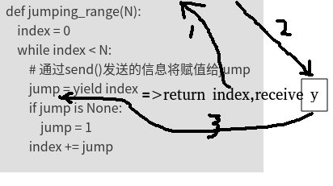
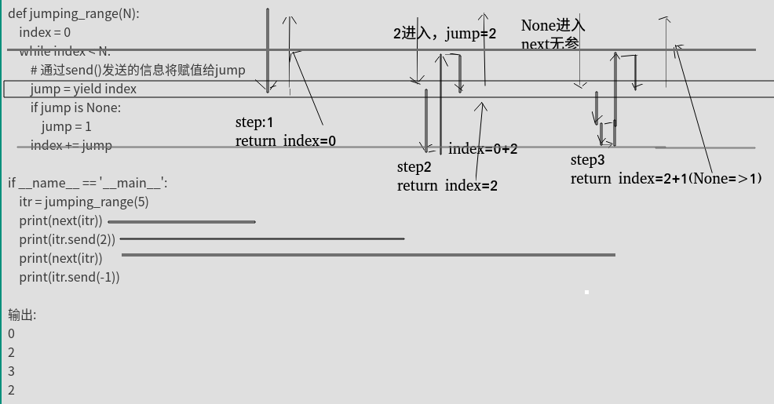
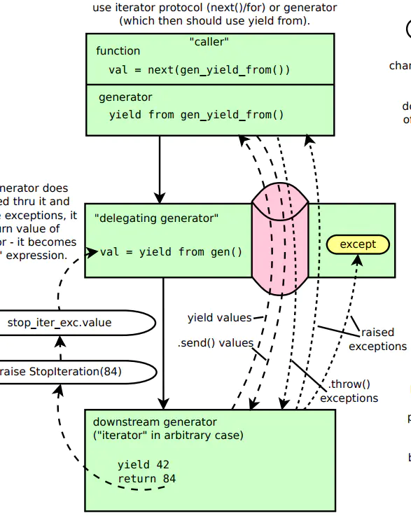

# python进阶02yield
yield关键字之前见过，也能读懂，但开发时也不大敢使用，感觉理解还是不够充分。刚好项目代码中有涉及，顺便再学习学习。

在理解yield之前，

## 可迭代，迭代器，生成器

```
可迭代对象，是其内部实现了，__iter__ 这个魔术方法。  
=>对比可迭代对象，迭代器其实就只是多了一个函数而已。就是__next__()，我们可以不再使用for循环来间断获取元素值。而可以直接使用next()方法来实现。  
==>生成器，则是在迭代器的基础上（可以用for循环，可以使用next()），再实现了yield。  
```
可以看出三者存在明显递进关系，越往后要求越苛刻，需实现方法也越多.(如果分不清，查阅本文参考文献第一篇)


## 猜测代码结果
看如下代码

```
## 第一段代码
items=[i for i in range(10)]
tmp=func(m)#func是一函数  
print(func02(tmp))# func02是另一个函数
print(func02(tmp))  

## 第二段代码
items=[i for i in range(10)]
tmp=func(m)#func是一函数  
print(func02(func(m)))# func02是另一个函数
print(func02(func(m)))  
```
请问这二者输出相同么？如果不考虑前文的铺垫，孤零零放出这么一段代码，可能9成都会不假思索的说相同。因为第二段代码，其实就是把一个变量多定义几遍而已。

由于tmp=func(m)，所以func02(tmp)等价于func02(func(m)),再结合软件开发中的业务逻辑确定性原则（同输入同输出），所以这两段代码输出必然相同。如果稍稍思考下就能发现，其实这个说法是有问题的，如果func02就是next()函数呢？显然输出会不同。

长久的编程习惯会让我们忽略一些东西，yield就属于忽略点，其内部等价于内置了"状态机"的概念。


如果对上面代码持有异议，可运行如下代码

```
def flatten(items, ignore_types=(str, bytes)):
    for x in items:
        if isinstance(x, Iterable) and not isinstance(x, ignore_types):
            yield from flatten(x)
        else:
            yield x
以下不同
tmp=flatten(items)
print(next(flatten(items)))
print(next(flatten(items)))
print(next(flatten(items)))
print(next(flatten(items)))

tmp=flatten(items)
print(next(tmp))
print(next(tmp))
print(next(tmp))
print(next(tmp))

```
## yield简单介绍
yield 是什么东西呢，它相当于我们函数里的return。在每次next()，或者for遍历的时候，都会yield这里将新的值返回回去，并在这里阻塞，等待下一次的调用。记住要点，yield相关的**2个动作和2个状态，return-自我阻塞-(别人)xx动作-唤醒(自己)**，完整就是,return之后，自动，自我阻塞，然后，等待xx的动作，唤醒自己。这个要记牢，否则后面容易懵。

如何创建一个生成器，主要有如下两种方法

```
# 01,使用列表生成式，注意不是[]，而是()
L = (x * x for x in range(10))
print(isinstance(L, Generator))  # True

# 02,实现了yield的函数
def mygen(n):
    now = 0
    while now < n:
        yield now
        now += 1

if __name__ == '__main__':
    gen = mygen(10)
    print(isinstance(gen, Generator))  # True
```

如何运行/激活生成器

```
使用next()
使用generator.send(None)
```
这就是yield基础知识.


## yield个人理解01,缓冲型(延迟型)list
就是把yield的函数看做普通list列表，不过是他什么时候用到什么时候计算，不关心他怎么实现的(或者什么时候真正执行的)。

这么理解，基本上大部分yield函数，看懂是没问题的，但是写呢？依然难以下手，因为不清楚每一行代码是如何运行的。 我之前就是这么理解的，阅读足够，开发不足。


## yield个人理解02,多return时序函数
首先以下定义结构

```
yield x=>等价于=>return x,receive y  
```
举例:执行到yield时

连线1，返回。先return index,然后自我阻塞,

连线2，等待填充。y哪里其实是个空位，意味这等待外部向这里填充数据（如何填充?前面介绍的next or send）.

连线3，填充后继续。填充数据之后，传递给yield index,中yield开始的位置，此处为=的右侧，所以receive后会赋值给jump


所以说yield的执行其实是"时序"型的，一个“时钟”就是一个next(or send),每走一步，return之后，等待,等别人通过next(or send)，叫醒自己继续走.

从时间角度看，yield函数其实有"一系列不同时间的返回值"。

所以其非常适合"需要捕捉中间结果的迭代计算"




## yield实例和分析

```
def jumping_range(N):
    index = 0
    while index < N:
        # 通过send()发送的信息将赋值给jump
        jump = yield index
        if jump is None:
            jump = 1
        index += jump

if __name__ == '__main__':
    itr = jumping_range(5)
    print(next(itr))
    print(itr.send(2))
    print(next(itr))
    print(itr.send(-1))

输出:
0
2
3
2


```


分析:

如下图，粗黑线部分就是程序代码执行流，可见index=0这部分代码其实只执行了一次,后续每次next后程序起点都是Jump=xx

这种角度看，yield非常类似我们debug程序时加入的断点，断点处return 当前取值,然后set 新的取值.





## yield continue和break
```
def get_detection_result():
    tmpi = 0
    ret = True
    while ret:
        if tmpi % 4 == 0:
            tmpi += 1
            yield #continue
        elif tmpi % 4 == 1:
            tmpi += 1
            ret = False
            yield #break ,will raise exception 
        elif tmpi % 4 == 2:
            tmpi += 1
            m = yield tmpi
            print(m) # common multi return 
        else:
            print('xxxxxxx') # dead loop
f = get_detection_result()
print(next(f))
print(f.send(101))
print(f.send(102))
```

## 胞兄yield from
简单的理解

```
# 字符串
astr='ABC'
# 列表
alist=[1,2,3]
# 字典
adict={"name":"wangbm","age":18}
# 生成器
agen=(i for i in range(4,8))

def gen(*args, **kw):
    for item in args:
        # yield 方法
        for i in item:
            yield i
        # yield from方法
        #yield from item

new_list=gen(astr, alist, adict， agen)
print(list(new_list))
# ['A', 'B', 'C', 1, 2, 3, 'name', 'age', 4, 5, 6, 7]
```
可以简单理解为

```
yield from item
等价于
for i in item:
    yield i
```
委托生成器的作用是：在调用方与子生成器之间建立一个双向通道。

所谓的双向通道是什么意思呢？

调用方可以通过send()直接发送消息给子生成器，而子生成器yield的值，也是直接返回给调用方。




## 参考文献

[Python并发编程之从生成器使用入门协程（七）](https://www.cnblogs.com/wongbingming/p/9060989.html)

[Python并发编程之深入理解yield from语法（八）](https://www.cnblogs.com/wongbingming/p/9085268.html)

[Python yield from 用法详解](https://www.jianshu.com/p/87da832730f5)


