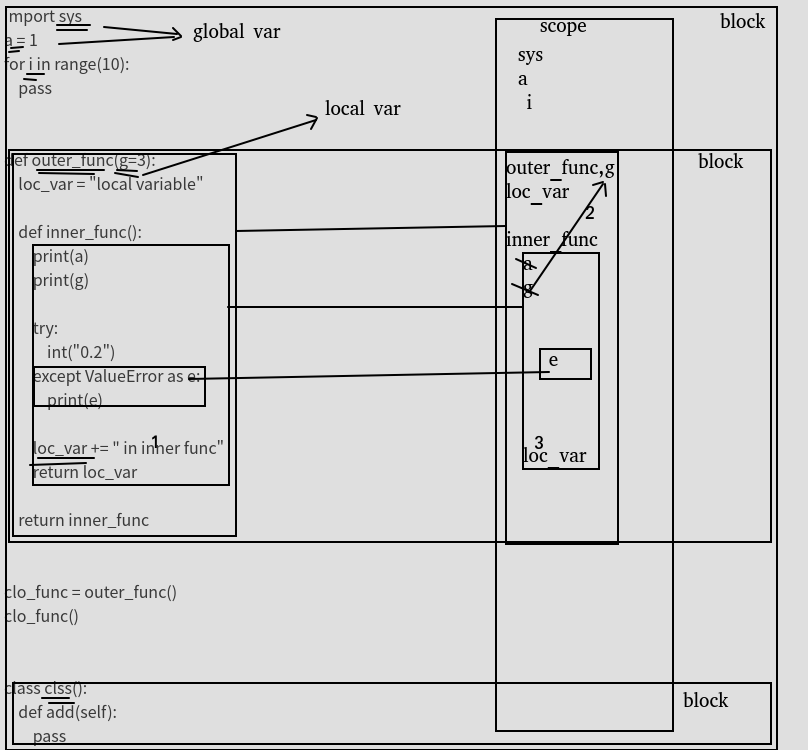

# python进阶03UnboundLocalError和NameError错误
## 几个概念

code block：作为一个单元(Unit)被执行的一段python程序文本。例如一个模块、函数体和类的定义等。

scope：在一个code block中定义name的可见性；

block’s environment：对于一个code block，其所有scope中可见的name的集合构成block的环境。

bind name：下面的操作均可视为绑定操作

```
函数的形参
import声明
类和函数的定义
赋值操作
for循环首标
异常捕获中相关的赋值变量
```
local variable：如果name在一个block中被绑定，该变量便是该block的一个local variable。

global variable：如果name在一个module中被绑定，该变量便称为一个global variable。

free variable: 如果一个name在一个block中被引用，但没有在该代码块中被定义，那么便称为该变量为一个free variable。


关于变量作用域参考博文：python进阶14变量作用域LEGB


## 经典案例1
```
def outer_func():
    loc_var = "local variable"
    def inner_func():
        loc_var += " in inner func"
        return loc_var
    return inner_func

clo_func = outer_func()
clo_func()
```

错误提示:

```
Traceback (most recent call last):
  File "G:\Project Files\Python Test\Main.py", line 238, in <module>
    clo_func()
  File "G:\Project Files\Python Test\Main.py", line 233, in inner_func
    loc_var += " in inner func"
UnboundLocalError: local variable 'loc_var' referenced before assignment
```
## 经典案例2
```
def get_select_desc(name, flag, is_format = True):
    if flag:
        sel_res = 'Do select name = %s' % name
    return sel_res if is_format else name

get_select_desc('Error', False, True)
```
错误提示：

```
Traceback (most recent call last):
  File "G:\Project Files\Python Test\Main.py", line 247, in <module>
    get_select_desc('Error', False, True)
  File "G:\Project Files\Python Test\Main.py", line 245, in get_select_desc
    return sel_res if is_format else name
UnboundLocalError: local variable 'sel_res' referenced before assignment
```
## 经典案例3
```
def outer_func(out_flag):
    if out_flag:
        loc_var1 = 'local variable with flag'
    else:
        loc_var2 = 'local variable without flag'
    def inner_func(in_flag):
        return loc_var1 if in_flag else loc_var2
    return inner_func

clo_func = outer_func(True)
print clo_func(False)
```
错误提示：

```
Traceback (most recent call last):
  File "G:\Project Files\Python Test\Main.py", line 260, in <module>
    print clo_func(False)
  File "G:\Project Files\Python Test\Main.py", line 256, in inner_func
    return loc_var1 if in_flag else loc_var2
NameError: free variable 'loc_var2' referenced before assignment in enclosing scope
```

## 分析案例
```
import sys
a = 1
for i in range(10):
    pass


def outer_func(g=3):
    loc_var = "local variable"

    def inner_func():
        print(a)
        print(g)

        try:
            int("0.2")
        except ValueError as e:
            print(e)

        loc_var += " in inner func"
        return loc_var

    return inner_func


clo_func = outer_func()
clo_func()


class clss():
    def add(self):
        pass
```

分析

1,双下划线:根据bind定义，识别为scope可见的变量

2,scope可见是存在层次关系的,越靠左侧说明包含范围越大（类似作用域的感觉),越靠右侧，包含范围越小，（作用域越小）

3,图中表明1和3的地方就是，标准案例1的问题点.loc_var由于在赋值语句“＝”的左边，所以别认为是scope内(可见)变量，所以执行loc_var=loc_var+"xx"时，会从最近的scope加载loc_var,最近的loc_var恰好指向自己，但是此时的"loc_var"尚且未被初始化，所以报错。

4,相比较，图中2,变量"g"在局部也未被初始化，但是却未报错，应为g在scope中未找到，所以自动向上找(往范围更大的找)，就找到入参处的变量”g"了。





## 参考
[UnboundLocalError，探讨Python中的绑定](https://www.cnblogs.com/friedCoder/p/12571983.html)

[Python UnboundLocalError和NameError错误根源解析](https://www.cnblogs.com/yssjun/p/9873689.html)

