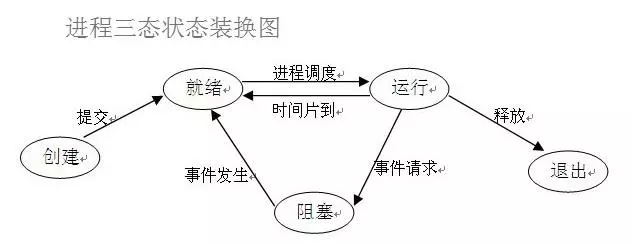
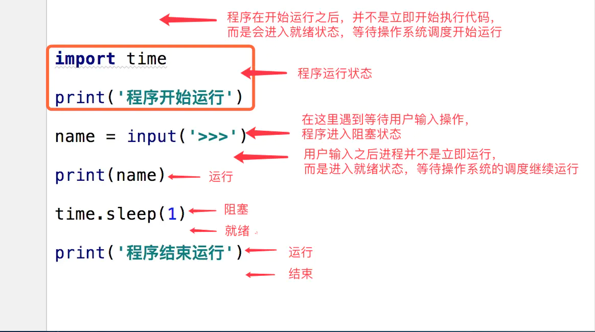
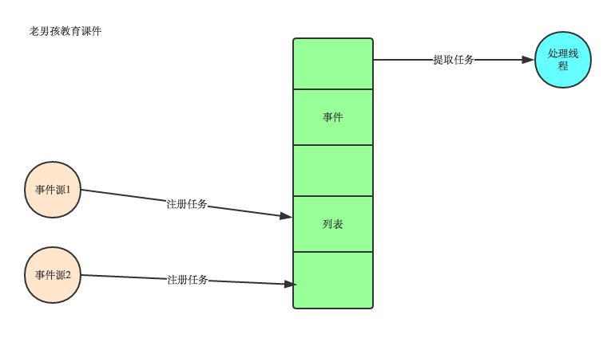
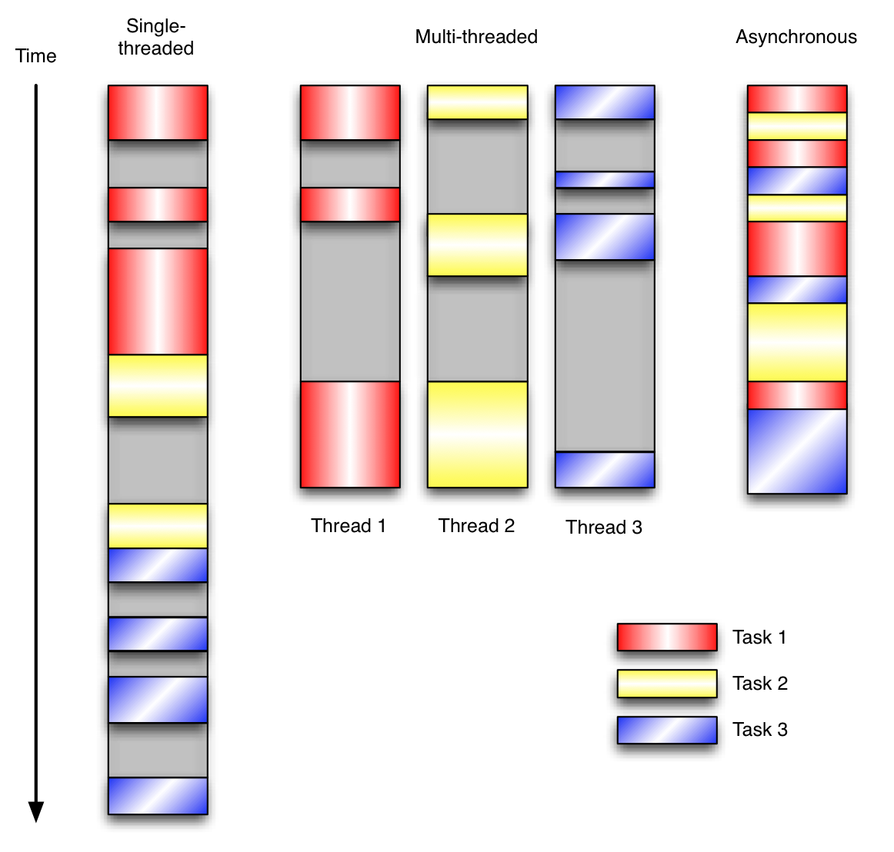

# python进阶05并发之一基本概念
大多编程语言，一旦涉及并发，都会比较复杂，知识点也较多（大多为历史问题，很多技术点现在非常少使用了，但语言层面也提供支持，对于这些冷门点，只需要知道即可，使用时也**尽量避免使用这种冷门技术**，除非和应用场景非常匹配）。实际使用过程中，只需要知道各名词以及大概功能，大多现用现查，毕竟涉及点太多，而且使用频率也并非很高，一般也就新系统研发会使用，后续维护时基本不会涉及太多。


## 进程状态和调度






## 进程,线程,协程
1、进程

进程是具有一定独立功能的程序关于某个数据集合上的一次运行活动,进程是系统进行**资源**分配和调度的一个独立单位。每个进程都有自己的独立内存空间，不同进程通过进程间通信来通信。由于进程比较重量，占据独立的内存，所以上下文进程间的切换开销（栈、寄存器、虚拟内存、文件句柄等）比较大，但相对比较稳定安全。

2、线程

线程是进程的一个实体,是**CPU调度**和分派的基本单位,它是比进程更小的能独立运行的基本单位.线程自己基本上不拥有系统资源,只拥有一点在运行中必不可少的资源(如程序计数器,一组寄存器和栈),但是它可与同属一个进程的其他的线程共享进程所拥有的全部资源。线程间通信主要通过共享内存，上下文切换很快，资源开销较少，但相比进程不够稳定容易丢失数据。

3、协程

协程是一种**用户态的轻量级线程**，协程的调度完全由用户控制。协程拥有自己的寄存器上下文和栈。协程调度切换时，将寄存器上下文和栈保存到其他地方，在切回来的时候，恢复先前保存的寄存器上下文和栈，直接操作栈则基本没有内核切换的开销，**可以不加锁的访问全局变量**，所以上下文的切换非常快。


## 多进程和多线程
在数据共享、同步方面，多进程是数据共享复杂，需要用IPC，数据是分开的，同步简单。多线程因为共享进程数据，数据共享简单，但同步复杂；

在内存、CPU方面，多进程占用内存多，切换复杂，CPU利用率低。

多线程占用内存少，切换简单，CPU利用率高；

在创建销毁、切换方面，多进程创建销毁、切换复杂，速度慢。多线程创建销毁、切换简单，速度很快；

在编程、调试方面，**多进程编程和调试都简单。多线程编程和调试都复杂**；

**可靠性方面，多进程间不会互相影响。多线程中的一个线程挂掉将导致整个进程挂掉；**

在分布式方面，多进程适应于多核、多机分布式。多线程适应于多核分布式。


**多进程模式最大的优点就是稳定性高**，因为一个子进程崩溃了，不会影响主进程和其他子进程。（当然主进程挂了所有进程就全挂了，但是Master进程只负责分配任务，挂掉的概率低）著名的Apache最早就是采用多进程模式。

**多进程模式的缺点是创建进程的代价大**，在Unix/Linux系统下，用fork调用还行，在Windows下创建进程开销巨大。另外，操作系统能同时运行的进程数也是有限的，在内存和CPU的限制下，如果有几千个进程同时运行，操作系统连调度都会成问题。

多线程模式通常比多进程快一点，但是也快不到哪去，而且，**多线程模式致命的缺点**就是任何一个线程挂掉都可能直接造成**整个进程崩溃**，因为所有线程共享进程的内存。在Windows上，如果一个线程执行的代码出了问题，你经常可以看到这样的提示：“该程序执行了非法操作，即将关闭”，其实往往是某个线程出了问题，但是操作系统会强制结束整个进程。

**在Windows下，多线程的效率比多进程要高**，所以微软的IIS服务器默认采用多线程模式。由于多线程存在稳定性的问题，IIS的稳定性就不如Apache。为了缓解这个问题，IIS和Apache现在又有多进程+多线程的混合模式，真是把问题越搞越复杂。


| 对比维度 | 多进程 | 多线程 | 总结 |
| --- | --- | --- | --- |
| 数据共享、同步 | 数据共享复杂，需要用IPC；数据是分开的，**同步简单** | 因为共享进程数据，**数据共享简单**，但也是因为这个原因导致同步复杂 | 各有优势 |
| 内存、CPU | 占用内存多，切换复杂，CPU利用率低 | **占用内存少，切换简单，CPU利用率高** | 线程占优 |
| 创建销毁、切换 | 创建销毁、切换复杂，速度慢 | **创建销毁、切换简单，速度很快** | 线程占优 |
| 编程、调试 | **编程简单，调试简单** | 编程复杂，调试复杂 | 进程占优 |
| 可靠性 | **进程间不会互相影响** | 一个线程挂掉将导致整个进程挂掉 | 进程占优 |
| 分布式 | **适应于多核、多机分布式**；如果一台机器不够，扩展到多台机器比较简单 | 适应于多核分布式 | 进程占优 |


## 线程和协程
协程:又被称为用户级线程或绿色线程。

1) 一个线程可以多个协程，一个进程也可以单独拥有多个协程，这样python中则能使用多核CPU。

2) 线程进程都是同步机制，而协程则是异步

3) 协程能保留上一次调用时的状态，每次过程重入时，就相当于进入上一次调用的状态


## 事件驱动(协程依赖)
在UI编程中，常常要对鼠标点击进行相应，首先如何获得鼠标点击呢？

方式一：创建一个线程，该线程一直循环检测是否有鼠标点击，那么这个方式有以下几个缺点：

```
1. CPU资源浪费，可能鼠标点击的频率非常小，但是扫描线程还是会一直循环检测，这会造成很多的CPU资源浪费；如果扫描鼠标点击的接口是阻塞的呢？
2. 如果是堵塞的，又会出现下面这样的问题，如果我们不但要扫描鼠标点击，还要扫描键盘是否按下，由于扫描鼠标时被堵塞了，那么可能永远不会去扫描键盘；
3. 如果一个循环需要扫描的设备非常多，这又会引来响应时间的问题；
```
所以，该方式是非常不好的


方式二：就是事件驱动模型

目前大部分的UI编程都是事件驱动模型，如很多UI平台都会提供onClick()事件，这个事件就代表鼠标按下事件。事件驱动模型大体思路如下：

```
1. 有一个事件（消息）队列；
2. 鼠标按下时，往这个队列中增加一个点击事件（消息）；
3. 有个循环，不断从队列取出事件，根据不同的事件，调用不同的函数，如onClick()、onKeyDown()等；
4. 事件（消息）一般都各自保存各自的处理函数指针，这样，每个消息都有独立的处理函数；
```



事件驱动编程是一种编程范式，这里程序的执行流由外部事件来决定。它的特点是包含一个事件循环，当外部事件发生时使用回调机制来触发相应的处理。另外两种常见的编程范式是（单线程）同步以及多线程编程。

让我们用例子来比较和对比一下单线程、多线程以及事件驱动编程模型。下图展示了随着时间的推移，这三种模式下程序所做的工作。这个程序有3个任务需要完成，每个任务都在等待I/O操作时阻塞自身。阻塞在I/O操作上所花费的时间已经用灰色框标示出来了





当我们面对如下的环境时，事件驱动模型通常是一个好的选择：

```
程序中有许多任务，而且…
任务之间高度独立（因此它们不需要互相通信，或者等待彼此）而且…
在等待事件到来时，某些任务会阻塞。
当应用程序需要在任务间共享可变的数据时，这也是一个不错的选择，因为这里不需要采用同步处理。
```
网络应用程序通常都有上述这些特点，这使得它们能够很好的契合事件驱动编程模型。

总结：异步IO涉及到了事件驱动模型，进程中维护一个**消息队列**，当客户端又请求时，就会把请求添加到消息队列中，线程从消息队列中**轮询取要处理的请求**，遇到I/O阻塞时（操作系统处理调用I/O接口处理，与程序无关），则进行上下文切换，处理其他请求，当I/O操作完成时，调用回调函数，告诉线程处理完成，然后再切换回来，处理完成后返回给客户端  Nginx能处理高并发就是用的这个原理


## 参考
[进程和线程、协程的区别](https://www.cnblogs.com/lxmhhy/p/6041001.html)

[进程 vs. 线程](https://www.liaoxuefeng.com/wiki/1016959663602400/1017631469467456)

[以Python爬取数据为例，多线程和多进程的优劣](https://blog.csdn.net/u014603907/article/details/99747107)

[在多核CPU下，同一进程下的多个线程可以并行运行吗](https://bbs.csdn.net/topics/270083226)

[python并发编程之多进程(实践篇)](https://www.cnblogs.com/jiangfan95/p/11439207.html)

[python多进程原理及其实现（1-6总结，较好）](https://blog.csdn.net/qq_31362767/article/details/87474466)

[python之路多进程和多线程总结(四)](https://www.cnblogs.com/zhen1996/articles/9692988.html)

[一文看懂Python多进程与多线程编程(工作学习面试必读)](https://blog.csdn.net/weixin_42134789/article/details/82992326)

[搞定python多线程和多进程（详细）](https://blog.csdn.net/qq_34802511/article/details/81233324)

[Python的进程间通信](https://www.jianshu.com/p/acf67126d804)

[Python进程间共享数据（三）（dict、list）](https://blog.csdn.net/ssssSFN/article/details/93517467)

[多进程,多线程,协程实现简单举例](https://blog.csdn.net/qq_31362767/article/details/88728839#_1)

[异步IO、多线程、多进程](https://blog.csdn.net/m0_37886429/article/details/82385500)

[Python开发【第九章】：线程、进程和协程](https://www.cnblogs.com/lianzhilei/p/5881434.html)

[multiprocess模块使用进程池调用apply_async()提交的函数及回调函数不执行问题](https://blog.csdn.net/weixin_40976261/article/details/89006082)

[协程/进程/线程资料收集](https://draapho.github.io/2016/11/14/1615-software-thread/)


