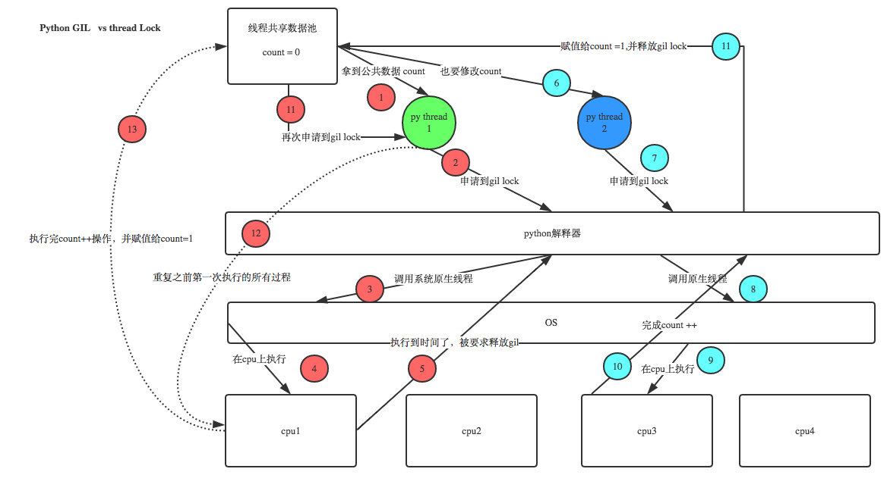

# python进阶07并发之三其他问题
## 何时使用多进程(线程)
使用多进程or线程,对于python，考虑到GIL锁，基本上**默认使用多进程**就对了。

除此之外，线程**共享全局变量**，进程**全局变量则是隔离的**，实际进程大多数情况需要通信的，所以也需要考虑共享数据读写问题处理。 决定因素稳定性和数据共享要求上（操作系统差异性，win偏好线程，linux偏好进程）

性能上虽然线程较好，但实际除了大型互联网公司和部分专业性质软件，大多数中小型公司的并发量，并不会带来很大影响，况且目前服务器领域，基本上LInux和Unix占比较高，线程相比进程在性能上优势并不十分突出。所以这方面考量不会太大的。


以下几种情况可考虑多进程(线程)

```
循环（互相独立，无内部依赖）
耗时操作，批量下载IO等操作，典型的是网络爬虫
分叉型计算，典型的是分治算法，或mapreduce的map阶段
```

## python多线程既然有GIL锁为何还需要加锁
Python已经有一个GIL来保证同一时间只能有一个线程来执行了，为什么这里还需要lock? 注意啦，这里的lock是用户级的lock,跟那个GIL没关系 ，具体我们通过下图来看一下



简单来说就是，**“GIL同一时间只有一个线程执行”是微观层面锁**，但我们需要加锁的是**宏观层面锁**。

比如  锁(process_a1,process_a2,process_a3),和 锁(process_b1,process_b2,process_b3)，如果去掉锁，仅仅依赖GIL的机制,则可能出现：process_a1,process_b1,process_a2.process_b2,process_a3,process_b3，可能导致错误数据出现.


相比之下，**协程里的多线程(的共享数据访问)则是不需要加锁的**！因为从**用户层面看，协程是多线程的**。但**虚拟机层面，其实单线程的**，协程内部进行cpu执行权利的自行控制。关于单线程实现多线程并发执行，可参考 博文"并发之一基本概念的事件模型部分"。


## 同进程不同线程可运行在不同核心上？

这个还要看编程语言的线程模型。**某些语言（如python）的线程模型不支持并行运行在多个核上**

实际上有些操作系统在内部并不分进程和线程，调度方式是一致的。比如**Linux，共享内存的就是线程，不共享内存的就是进程**，然后把包装好的创建函数暴露给POSIX API。

现在同一进程下的多个线程是可以在多核CPU下并行运行的。但2.4内核及以前的系统实现的线程没有内核支持，无法在多核的情况下并行运行。

多线程的概念主要有两种：一种是**用户态多线程**；一种是**内核态多线程**

内核态多线程，如楼上所言，在操作系统内核的支持下可以在多核下并行运行；

对于用户态多线程，尽管没有内核的直接支持，但若一个用户态线程对应于内核的一个进程的话（从这个角度，内核还是间接支持的），仍然是可以在多核上并行运行的。

因此，这归结为，用户态多线程的实现技术。

似乎目前Linux上的用户态多线程，就是利用了内核的进程来实现的。

如果是内核线程（就是fork出来的，pthread_create在2.4后最终也用fork，具体参看其实现），那么可以调度到多cpu，内核支持线程的诱导因素之一就是可以利用多cpu资源进行并行计算；如果是用户线程，那么就不能在多cpu上并行计算了，用户库线程的弊端之一就是不能利用多cpu资源；


## 线程是并发还是并行，进程是并发还是并行？

**线程是并发**，**进程是并行**；

现代os都将**线程作为最小调度单位**，进程作为**资源分配的最小单位**。


## 父子进程如何区分?
​ 子进程是父进程通过fork()产生出来的，pid = os.fork()

​ 通过**返回值pid是否为0**，判断是否为子进程，如果是0，则表示是子进程

​ 由于 fork() 是 Linux 上的概念，所以如果要跨平台，最好还是使用 subprocess 模块来创建子进程。


## 子进程如何回收？
python中采用os.wait()方法用来回收子进程占用的资源

pid, result = os.wait() # 回收子进程资源　阻塞，等待子进程执行完成回收

如果有子进程没有被回收的，但是父进程已经死掉了，这个子进程就是僵尸进程。孤儿进程,父类进程over.,子进程未结束


## 使用多处理池的apply_async方法时，谁运行回调
回调在主进程中处理，但单独线程(循环方式依次处理)

参考：[使用多处理池的apply_async方法时，谁运行回调？](https://www.it1352.com/500557.html)


## 异常处理,异常消失问题


## 参考
[进程和线程、协程的区别](https://www.cnblogs.com/lxmhhy/p/6041001.html)

[进程 vs. 线程](https://www.liaoxuefeng.com/wiki/1016959663602400/1017631469467456)

[以Python爬取数据为例，多线程和多进程的优劣](https://blog.csdn.net/u014603907/article/details/99747107)

[在多核CPU下，同一进程下的多个线程可以并行运行吗](https://bbs.csdn.net/topics/270083226)

[python并发编程之多进程(实践篇)](https://www.cnblogs.com/jiangfan95/p/11439207.html)

[python多进程原理及其实现（1-6总结，较好）](https://blog.csdn.net/qq_31362767/article/details/87474466)

[python之路多进程和多线程总结(四)](https://www.cnblogs.com/zhen1996/articles/9692988.html)

[一文看懂Python多进程与多线程编程(工作学习面试必读)](https://blog.csdn.net/weixin_42134789/article/details/82992326)

[搞定python多线程和多进程（详细）](https://blog.csdn.net/qq_34802511/article/details/81233324)

[Python的进程间通信](https://www.jianshu.com/p/acf67126d804)

[Python进程间共享数据（三）（dict、list）](https://blog.csdn.net/ssssSFN/article/details/93517467)

[多进程,多线程,协程实现简单举例](https://blog.csdn.net/qq_31362767/article/details/88728839#_1)

[异步IO、多线程、多进程](https://blog.csdn.net/m0_37886429/article/details/82385500)

[Python开发【第九章】：线程、进程和协程](https://www.cnblogs.com/lianzhilei/p/5881434.html)

[multiprocess模块使用进程池调用apply_async()提交的函数及回调函数不执行问题](https://blog.csdn.net/weixin_40976261/article/details/89006082)  