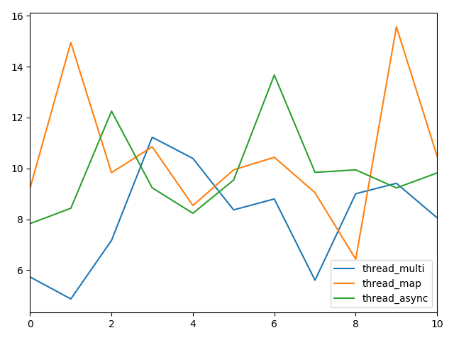
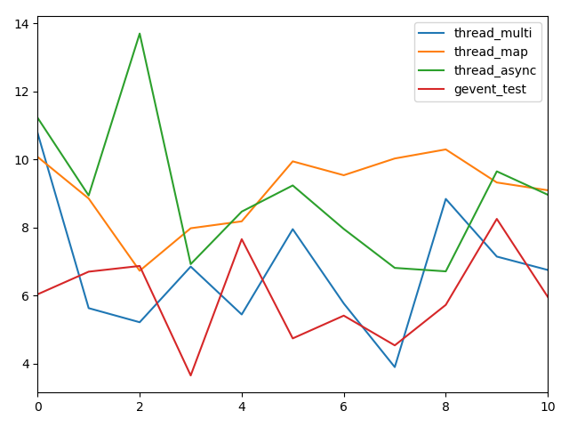
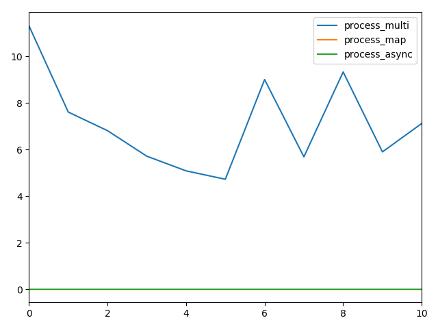

# python进阶11并发之七多种并发方式的效率测试
测试map,apply_async,gevent协程爬虫  
测试代码:网页爬虫  

## 函数代码  
```
def thread_multi():
    threads = list()
    for url in urls:
        threads.append(threading.Thread(target=process, args=(url,)))
    [t.start() for t in threads]
    [t.join() for t in threads]


def thread_map():
    pool = ThreadPool(max(1, cpu_count() - 1))
    results = pool.map(process, urls)
    pool.close()
    pool.join()
    print(results)


def thread_async():
    pool = ThreadPool(max(1, cpu_count() - 1))
    results = list()
    for url in urls:
        results.append(pool.apply_async(process, args=(url,)))
    pool.close()
    pool.join()
    print([result.get() for result in results])


def process_multi():
    processes = list()
    for url in urls:
        processes.append(Process(target=process, args=(url,)))
    [t.start() for t in processes]
    [t.join() for t in processes]


def process_map():
    pool = Pool(processes=max(1, cpu_count() - 1))
    results = pool.map(process, urls)
    pool.close()
    pool.join()
    print(results)


def process_async():
    pool = Pool(processes=max(1, cpu_count() - 1))
    results = list()
    for url in urls:
        results.append(pool.apply_async(process, (url,)))
    pool.close()
    pool.join()
    print([result.get() for result in results])
```

## 测试结果concurrentOpt  
  


  


|      | thread_multi | thread_map | thread_async | process_multi | process_map | process_async |
| ---- | ------------ | ---------- | ------------ | ------------- | ----------- | ------------- |
| 0    | 5.732065     | 9.236784   | 7.831096     | 9.954077      | 9.778723    | 12.086315     |
| 1    | 4.868261     | 14.948347  | 8.431347     | 9.679722      | 17.086732   | 6.354689      |
| 2    | 7.17074      | 9.833528   | 12.248446    | 6.584711      | 17.405191   | 17.600024     |
| 3    | 11.223755    | 10.848167  | 9.235662     | 6.841372      | 9.969995    | 11.37249      |
| 4    | 10.391303    | 8.540373   | 8.236726     | 10.971645     | 8.964562    | 9.265784      |
| 5    | 8.3693       | 9.942565   | 9.541138     | 8.789822      | 8.266148    | 10.571744     |
| 6    | 8.799133     | 10.436757  | 13.669565    | 10.497021     | 9.668785    | 10.168379     |
| 7    | 5.603222     | 9.04568    | 9.843495     | 4.587275      | 14.596141   | 10.470989     |
| 8    | 9.003843     | 6.43141    | 9.941858     | 4.738146      | 8.170778    | 9.773284      |
| 9    | 9.414749     | 15.56822   | 9.23152      | 8.254023      | 8.781076    | 14.082026     |
| 10   | 8.0576371    | 10.4831831 | 9.8210853    | 8.0897814     | 11.2688131 | 11.1745724    |
最后一行为均值  

## 测试结果concurrentOptGevent  
  

  


|      | thread_multi | thread_map | thread_async | process_multi | process_map | process_async | gevent_test |
| ---- | ------------ | ---------- | ------------ | ------------- | ----------- | ------------- | ----------- |
| 0    | 10.770623    | 10.072167  | 11.220298    | 11.308327     | 3.40E-05    | 1.00E-05      | 6.035623    |
| 1    | 5.628367     | 8.850531   | 8.939288     | 7.608235      | 3.20E-05    | 1.00E-05      | 6.700398    |
| 2    | 5.214341     | 6.726455   | 13.69806     | 6.808565      | 3.20E-05    | 1.10E-05      | 6.868222    |
| 3    | 6.849362     | 7.976406   | 6.922554     | 5.7132        | 1.70E-05    | 5.00E-06      | 3.650169    |
| 4    | 5.442727     | 8.179533   | 8.46556      | 5.084351      | 3.00E-05    | 1.10E-05      | 7.655325    |
| 5    | 7.949327     | 9.9421     | 9.234288     | 4.723601      | 3.30E-05    | 1.00E-05      | 4.739602    |
| 6    | 5.765848     | 9.534865   | 7.956348     | 9.004707      | 2.00E-05    | 6.00E-06      | 5.40825     |
| 7    | 3.89613      | 10.026686  | 6.81114      | 5.685556      | 3.60E-05    | 1.00E-05      | 4.534598    |
| 8    | 8.838316     | 10.292949  | 6.709802     | 9.328648      | 1.80E-05    | 5.00E-06      | 5.724812    |
| 9    | 7.144312     | 9.321319   | 9.64821      | 5.898414      | 3.30E-05    | 1.00E-05      | 8.251311    |
| 10   | 6.7499353    | 9.0923011  | 8.9605548    | 7.1163604     | 2.85E-05    | 8.80E-06      | 5.956831    |
最后一行为均值  


## 总结

| concurrentOpt | 进程or线程 | 同步or异步(不大确定) | 阻塞or非阻塞(不大确定) |  平均时间   |
| ------------- | -------- | ----------------- | ------------------ | ---------- |
| thread_multi  | 多线程     | 异步              | 非阻塞              | 8.0576371  |
| thread_map    | 线程池     | (批)同步           | 阻塞                | 10.4831831 |
| thread_async  | 线程池     | 异步              | 非阻塞              | 9.8210853  |
| process_multi | 多进程     | 异步              | 非阻塞              | 8.0897814  |
| process_map   | 进程池     | （批）同步          | 阻塞                | 11.2688131 |
| process_async | 进程池     | 异步              | 非阻塞              | 11.1745724 |


| concurrentOptGevent | 进程or线程 | 同步or异步(不大确定) | 阻塞or非阻塞(不大确定) |  平均时间  |
| ------------------ | -------- | ----------------- | ------------------ | --------- |
| thread_multi        | 多线程     | 异步              | 非阻塞              | 6.7499353 |
| thread_map          | 线程池     | （批）同步          | 非阻塞              | 9.0923011 |
| thread_async        | 线程池     | 异步              | 非阻塞              | 8.9605548 |
| process_multi       | 多进程     | 异步              | 非阻塞              | 7.1163604 |
| process_map         | 进程池     | （批）同步          | 非阻塞              | 卡住      |
| process_async       | 进程池     | 异步              | 非阻塞              | 卡住      |
| gevent_test         | 协程      | 异步              | 非阻塞              | 5.956831 |

结论:  
01，启用gevent后，除了卡住的，线程和进程均加快1s左右时间  
02，协程在线程程序中是最快的  
03，多线程程序下载速度弱优于多进程  
04，不论是进程还是线程，使用thread_async都快于map  
05，不考虑协程时，多线程较线程池速度更快，多进程较进程池速度更快，这一点不大符合理论，个人感觉和url数量少有关.  

至于进程池在启用gevent后卡住的问题，网上也没查到相关的靠谱资料，哪位大牛晓得的话，求解释～  
测试代码:[github](https://github.com/yuanjh6/scripts)的concurrentOpt.py和concurrentOptGevent.py  
