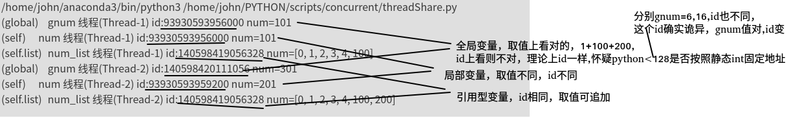
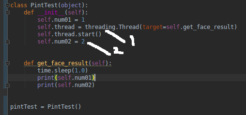
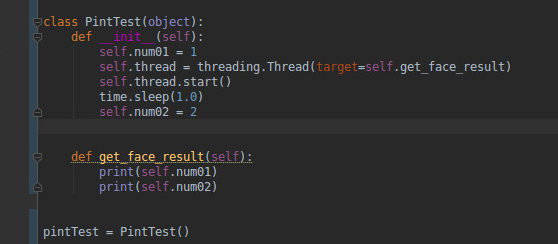
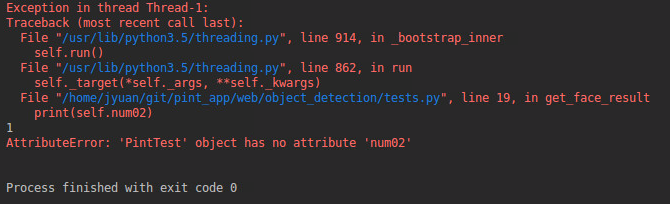
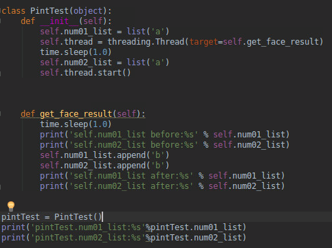
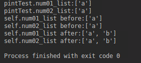
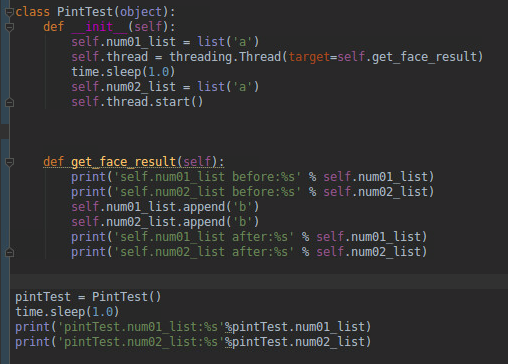
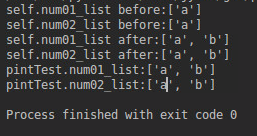

# python进阶12并发之八多线程与数据同步
python并发**首选进程**，但偶尔有场景进程无法搞定，比如有些**变量是无法序列化的**，就无法使用工具包**manager()的工具类进行共享**。如果自己实现新的共享方法，可能开发量较大，且质量难以保证。此时可考虑用线程处理，规避进程的变量共享难题，而且实际场景中,**IO大概率都是瓶颈**，所以使用线程其实也的确有些优势。个人而言，选择进程和线程较为重视的**安全性**，进程数据隔离较好，互不干扰。其次就是**公用数据占比**，如果大多数数据都需公用，那么线程也会比进程更佳，避免了进程较多的数据共享问题。  
线程而言，难点数据一致性，
## 哪些共享，哪些不共享
使用线程，大概率出现的情况，本以为没共享，实际共享了。由于(以为)没共享，所以没做同步处理，导致最后数据一团糟。  
参考代码:  
```
# coding=utf-8
############## 共享变量均未加锁，仅用来演示共享问题，未考虑同步问题 ###########
############# 线程的变量共享　#############
import threading
import time

gnum = 1


class MyThread(threading.Thread):
    # 重写 构造方法
    def __init__(self, num, num_list, sleepTime):
        threading.Thread.__init__(self)
        self.num = num
        self.sleepTime = sleepTime
        self.num_list = num_list

    def run(self):
        time.sleep(self.sleepTime)
        global gnum
        gnum += self.num
        self.num_list.append(self.num)
        self.num += 1
        print('(global)\tgnum 线程(%s) id:%s num=%d' % (self.name, id(gnum), gnum))
        print('(self)\t\tnum 线程(%s) id:%s num=%d' % (self.name, id(self.num), self.num))
        print('(self.list)\tnum_list 线程(%s) id:%s num=%s' % (self.name, id(self.num_list), self.num_list))


if __name__ == '__main__':
    mutex = threading.Lock()
    num_list = list(range(5))
    t1 = MyThread(100, num_list, 1)
    t1.start()
    t2 = MyThread(200, num_list, 5)
    t2.start()

```
执行结果:  
```
/home/john/anaconda3/bin/python3 /home/john/PYTHON/scripts/concurrent/threadShare.py
(global)	gnum 线程(Thread-1) id:93930593956000 num=101
(self)		num 线程(Thread-1) id:93930593956000 num=101
(self.list)	num_list 线程(Thread-1) id:140598419056328 num=[0, 1, 2, 3, 4, 100]
(global)	gnum 线程(Thread-2) id:140598420111056 num=301
(self)		num 线程(Thread-2) id:93930593959200 num=201
(self.list)	num_list 线程(Thread-2) id:140598419056328 num=[0, 1, 2, 3, 4, 100, 200]
```
结果解析:  
  

## 共享数据的同步(参考博文:python进阶06并发之二技术点关键词)
最简单做法，凡是会在多个线程中修改的共享对象(变量)，都加锁。这样可能会有部分锁多加了，但绝对好过不加，毕竟多加锁无非导致效率低下(也可能导致死锁)，而一旦该加的没有加，则会导致数据错误，二者孰轻孰重很清楚。建议多了解下"**原子操作**"，如果不熟悉，可以按照**先加锁，再删锁**的思路，将原子操作的锁删掉即可（业务逻辑开发阶段，哪些会在多个线程被修改，是很难想全面的。所以一般是先开发，实现业务逻辑思路，再找共享变量，尽可能缩小临界区间，最后再上锁）。这样一方面保险，另一方面也避免了过多锁带来的低效问题。

## thread完整版和简单版的关系
```
class Thread:
    def __init__(self, group=None, target=None, name=None,
                 args=(), kwargs=None, *, daemon=None):
        if kwargs is None:
            kwargs = {}
        self._target = target
        self._name = str(name or _newname())
        self._args = args
        self._kwargs = kwargs

    def run(self):
        try:
            if self._target:
                self._target(*self._args, **self._kwargs)
        finally:
            del self._target, self._args, self._kwargs
```

## 线程本身就有局部变量，为何还需要ThreadLocal？
ThreadLocal例子  
```
import threading
 
# 创建全局ThreadLocal对象:
local_school = threading.local()
 
def process_student():
  print 'Hello, %s (in %s)' % (local_school.student, threading.current_thread().name)
 
def process_thread(name):
  # 绑定ThreadLocal的student:
  local_school.student = name
  process_student()
 
t1 = threading.Thread(target= process_thread, args=('Alice',), name='Thread-A')
t2 = threading.Thread(target= process_thread, args=('Bob',), name='Thread-B')
t1.start()
t2.start()
t1.join()
t2.join()
```

网上没有查询到有效资料，说明个人理解吧，  
首先，如果你的线程采用了完整模式书写(定义class继承thread)，则的确不需要使用ThreadLocal，其__init__内完全可以定义对象自身的私有变量(list等引用型入参，可通过deepcopy复制出私有的一份).  
如果你想采用简洁模式, threading.Thread(target= process_thread, args=xx),那么其实是没有定义私有变量的地方的(也不是完全没有，如果是int,str等，本来就是形参，如果是list()则会共享)   

举例：  
```
############# 线程的变量共享(short mode)　#############
gnum = 1


def process(num, num_list, sleepTime):
    time.sleep(sleepTime)
    global gnum
    gnum += num
    num_list.append(num)
    num += 1
    print('(global)\tgnum 线程(%s) id:%s num=%d' % (threading.currentThread().name, id(gnum), gnum))
    print('(self)\t\tnum 线程(%s) id:%s num=%d' % (threading.currentThread().name, id(num), num))
    print('(self.list)\tnum_list 线程(%s) id:%s num=%s' % (threading.currentThread().name, id(num_list), num_list))


if __name__ == '__main__':
    mutex = threading.Lock()
    num_list = list(range(5))
    t1 = threading.Thread(target=process, args=(100, num_list, 1,))
    t1.start()
    t2 = threading.Thread(target=process, args=(200, num_list, 5,))
    t2.start()

```
结果:(和前面相同)  
```
(global)	gnum 线程(Thread-1) id:94051294298272 num=101
(self)		num 线程(Thread-1) id:94051294298272 num=101
(self.list)	num_list 线程(Thread-1) id:140412783240456 num=[0, 1, 2, 3, 4, 100]
(global)	gnum 线程(Thread-2) id:140412784295536 num=301
(self)		num 线程(Thread-2) id:94051294301472 num=201
(self.list)	num_list 线程(Thread-2) id:140412783240456 num=[0, 1, 2, 3, 4, 100, 200]
```

可见，对于单个函数的线程，其实没必要使用threadLocal  

那么那种情况需要使用呢？  
```
global_dict = {}

def std_thread(name):
    std = Student(name)
    # 把std放到全局变量global_dict中：
    global_dict[threading.current_thread()] = std
    do_task_1()
    do_task_2()

def do_task_1():
    # 不传入std，而是根据当前线程查找：
    std = global_dict[threading.current_thread()]
    ...

def do_task_2():
    # 任何函数都可以查找出当前线程的std变量：
    std = global_dict[threading.current_thread()]
    ...
```
对于存在调用子函数，且函数之间存在参数传递的情况才需要使用threadLocal  
同时，如果本身thread使用的就是完整模式的thread了，那么由于本身的self.xx已经是局部变量了，所以也不需要使用threadLocal进行中转保存.  
综上所述，其实threadLocal的使用场景是比较有限的，必须是thread简洁模式下，存在函数调用和传参的情况下在有必要使用。  

## 类锁还是实例锁?
由于锁和临界区是对应的（作为临界变量，临界区的保镖），如果临界变量（区)是类级别信息（比如统计类实例个数），就用类锁，否则就是实例锁。  

## 阻塞式io中，cpu分配时间片给阻塞线程么
运行态---wait/阻塞io-→阻塞态  
运行态-------调度--------→就绪态  
就绪态-------调度--------→运行态  
阻塞态---信号/io返回-→就绪态  
所以不占用时间片。  
sleep（）和wait()这两个函数被调用之后线程都应该放弃执行权，不同的是sleep（）不释放锁而wait（）的话是释放锁。直白的意思是一个线程调用Sleep（）之后进入了阻塞状态中的其他阻塞，它的意思就是当sleep()状态超时、join()等待线程终止或者超时，线程重新转入可运行(runnable)状态。而Wait（）是不同的在释放执行权之后wait也把锁释放了进入了线程等待阻塞，它要运行的话还是要和其他的线程去竞争锁，之后才可以获得执行权。  

## 多线程中,target为实例方法,可访问哪些变量的测试
举例：  
  

get_face_result中可以访问self里面的哪些资源？在1处（thread声明后，start前）和2处（start后）定义的变量可以访问么？  
主要疑惑：target=get_face_result，如果get_face_result看作普通函数，那么由于不存在全局变量，所以所有参数都应该从args传入,   
问题就是在get_face_result不是普通函数，不确定python是否会把self.里的变量传递到get_face_result内部（也就是self.里的实例变量看作 self.get_face_result的全局变量）  

结论：**以thraed.start为界，start之前一定可以访问**，start之后是否可以访问，视主线程和子线程执行速度，可能可以，可能不行  
所以：**1处的代码，子线程可以访问**，**2处的代码**，由子线程执行速度（访问2处赋值的变量的时间），和父线程**执行速度决定**，如果父线程速度快，那么2处的（子线程）也可以访问，否则，（子线程）无法访问。  
 
测试步骤  
测试01:如上图  
结果：  
```
1
2
```
结论：start后变量，如果有足够时间差，子线程就可以访问   
 
测试02：  
  
  

结论：start后变量，没有足够时间差，子线程无法访问
 
测试04：引用型变量会如何  
  
  
  
  

结论不变，start后，父线程子线程先后顺序影响了变量赋值  

## 参考
[python ThreadLocal](https://blog.csdn.net/u010660276/article/details/50574180)  
[深入理解Python中的ThreadLocal变量（上）](https://www.jianshu.com/p/74640d22a72f)  
[Python中ThreadLocal的理解与使用](https://www.cnblogs.com/linpd/p/10051945.html)    
[在阻塞式io中，如果一个线程在等待io操作，那么cpu还会分配时间片给该线程吗？](https://www.jianshu.com/p/c655e0a944ae)  