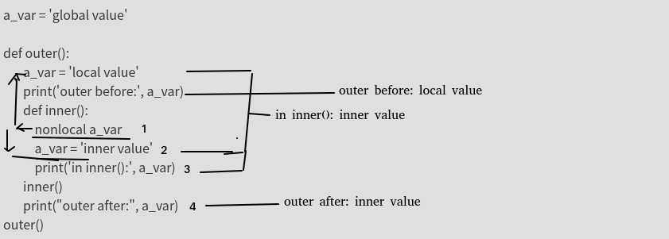

# python进阶14变量作用域LEGB
## 作用域

“作用域”定义了Python在哪一个层次上查找某个“变量名”对应的对象。接下来的问题就是：“Python在查找‘名称-对象’映射时，是按照什么顺序对命名空间的不同层次进行查找的？”  
答案就是：使用的是LEGB规则，表示的是Local -> Enclosed -> Global -> Built-in，其中的箭头方向表示的是搜索顺序。  
```
L: 先在局部变量中找，如果找不到
E：则去闭包变量中找，如果找不到
G：则去局部变量中找，如果找不到
B: 去内置变量中找，如果找不到，才报错 dir(__builtins__)
```
其中  
```
Local 可能是在一个函数或者类方法内部。
Enclosed 可能是嵌套函数内，比如说 一个函数包裹在另一个函数内部。
Global 代表的是执行脚本自身的最高层次。
Built-in 是Python为自身保留的特殊名称。
```

**python作用域是以函数、类、模块来区分的，而不是块**  
也就是说if、while，for并不会影响变量的作用域！！！,python中没有块作用域。  
这就能解释python的if __name__=='__mian__'中声明的变量同样是全局变量  

## 练习01  
```
a_var = 'global value'

def outer():
       a_var = 'local value'
       print('outer before:', a_var)
       def inner():
           nonlocal a_var
           a_var = 'inner value'
           print('in inner():', a_var)
       inner()
       print("outer after:", a_var)
outer()
```
结果:  
```
outer before: local value
in inner(): inner value
outer after: inner value
```

分析:  
  


## 练习02
```
a = 'global'

def outer():

    def len(in_var):
        print('called my len() function: ', end="")
        l = 0
        for i in in_var:
            l += 1
        return l

    a = 'local'

    def inner():
        global len
        nonlocal a
        a += ' variable'
    inner()
    print('a is', a)
    print(len(a))


outer()

print(len(a))
print('a is', a)
```
结果:  
```
a is local variable
called my len() function: 14
6
a is global
```
可自行分析试试  

## 注意点
01：在**函数作用域内修改全局变量通常是个坏主意**，因为这经常造成混乱或者很难调试的奇怪错误。如果你想要通过一个函数来修改一个全局变量，建议把它**作为一个变量传入，然后重新指定返回值**。  
02：如果我们提前在全局命名空间中明确定义了for循环变量，也是同样的结果！在这种情况下，它会重新绑定已有的变量：
**For循环变量“泄漏”到全局命名空间**  
```
b = 1
for b in range(5):
    if b == 4:
        print(b, '-> b in for-loop')
print(b, '-> b in global')

结果：
4 -> b in for-loop
4 -> b in global
```
在Python 3.x中，我们可以使用闭包来防止for循环变量进入全局命名空间。下面是一个例子（在Python 3.4中执行）：
```
i = 1
print([i for i in range(5)])
print(i, '-> i in global')

结果
[0, 1, 2, 3, 4]
1 -> i in global
```
为何for里面会有如此奇怪的规则？闭包本身具有独立作用域，所以这里的i对父域不会形成干扰。  

还有另一个副作用就是  
```
for i in range(5):
    print(i)
    i = 10
```
结果:  
```
0
1
2
3
4
```
而不是直观理解的执行一次就退出  

代码;  
```
for i in range(5):
    i += 5
    print(i)
print(i)
```
结果:  
```
5
6
7
8
9
9
```
第一：成功污染外面的i  
第二：内部i+5只进行了1次，说明i=i+5,右侧的i,是真正的for里面的i,左侧的i是外部的i，但是却未报错unbounderror的错误！(内部的i有赋值，所以理论上外部的i应该是被屏蔽的，应该报错unbound才对，但是没报。即使勉强接受这一点，最终外面的i=9而非4，也很奇怪)    

原因:**for循环不会引入新的作用域**，所以，循环结束后，继续执行print(i)，可以正常输出i，原理上与情况3中的if相似。这一点Python就比较坑了，因此写代码时切忌for循环名字要与其他名字不重名才行。  
上式中,for里面i+5,到外面的for那里又重新赋值为原有的i(无视了内部对i的修改)，所以**每次都+5了**，而最终结果依然+5，是由于**最后一次的i并未被成功赋值**，所以最终结果看起来比较奇.  

```
list_1 = [i for i in range(5)]
print(i)

结果:  
NameError: name 'i' is not defined
```
情况3中说到过，for循环不会引入新的作用域，那么为什么输出报错呢？真相只有一个：列表生成式会引入新的作用域，for循环是在Local作用域里面的。事实上，lambda、生成器表达式、列表解析式也是函数，都会引入新作用域。

## 参考
Python中的LEGB规则：https://www.cnblogs.com/GuoYaxiang/p/6405814.html  
Python中命名空间与作用域使用总结：https://www.cnblogs.com/chenhuabin/p/10123009.html  
一道题看Python的LEGB规则:https://www.ucloud.cn/yun/45499.html  
Python LEGB规则:https://www.jianshu.com/p/3b72ba5a209c  
python中的LEGB 规则:https://blog.csdn.net/xun527/article/details/76795328  
