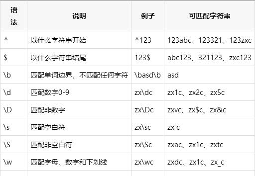
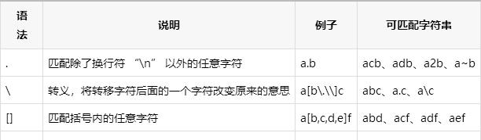
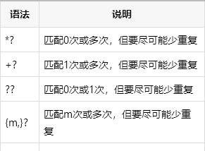

# python进阶17正则表达式
## 正则基础知识
```
^`:匹配行首
`$`:匹配结尾
`*`:（**贪婪**）前面字符匹配任意多次
`+`:（**懒惰**）前面字符匹配1或者更多次
`?`:前面字符匹配0或1次，还作为懒惰限定符使用，详看后面

`{m}`:前面字符匹配m次
`{m,n}`:前面字符匹配m~n次
`{m,}`:前面字符匹配m或更多次
`{,n}`:前面字符匹配0~n次

`|`:或,必须加括号

`.`:匹配除换行符以外的任意字符
`[1357]`:匹配1，3,5,7中其中一个数字，当然也可以是字母
`[0-9]`:匹配0到9的其中一个数字，类似用法还有：[a-zA-Z]
`[\u4E00-\u9FA5]`:匹配中文
`[^012]`:表示除012外的任意字符，包括3-9,a-z,A-Z,等等
注意：[]里面的.和*等一些特殊字符都失去特殊意义，只表示本身。
```









## 分组捕获
```
import re
str = 'booy123'
regex = '((boy|booy)123)'

# 如果有多个括号，则从最外面往里算，从1开始

re_match = re.match(regex, str)
re_match.group(1)
# 'booy123'
re_match.group(2)
# 'booy'
```

## 懒惰限定符
如果有多个贪婪，则第一个最贪婪

```
*? ：重复任意次，但尽可能少重复
+? ：重复1次或更多次，但尽可能少重复
?? ：重复0次或1次，但尽可能少重复
{n,m}? ：重复n到m次，但尽可能少重复
{n,}?： 重复n次以上，但尽可能少重复
str = 'abooabbapds aboksldap'
obj = re.compile('ab.*?ap') #注意用非贪婪匹配，不然list里只有一个
```
## 匹配和搜索
```
match_list = obj.findall(str)  #match_list是一个list
# match_list -> ['abooabbap','aboksldap']

for match in match_list:
    print(match)
# 输出
# abooabbap
# aboksldap
import re

str = 'abooabbapds aboksldap'
obj = re.compile('ab.*?ap')
match_list = obj.finditer(str)
# match_list -> callable_iterator对象，需要用group()查询

for match in match_list:
    print(match.group())
# abooabbap
# aboksldap
```


## 参考
Python正则表达式急速入门：https://baijiahao.baidu.com/s?id=1652504385879645545&wfr=spider&for=pc

正则表达式必知必会：python.iswbm.com/en/latest/c01/c01_11.html

Python 正则表达式：https://www.runoob.com/python/python-reg-expressions.html

Python正则表达式指南：https://www.cnblogs.com/huxi/archive/2010/07/04/1771073.html

