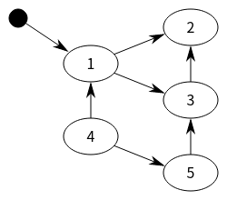
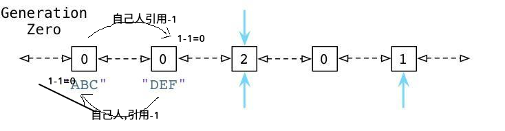
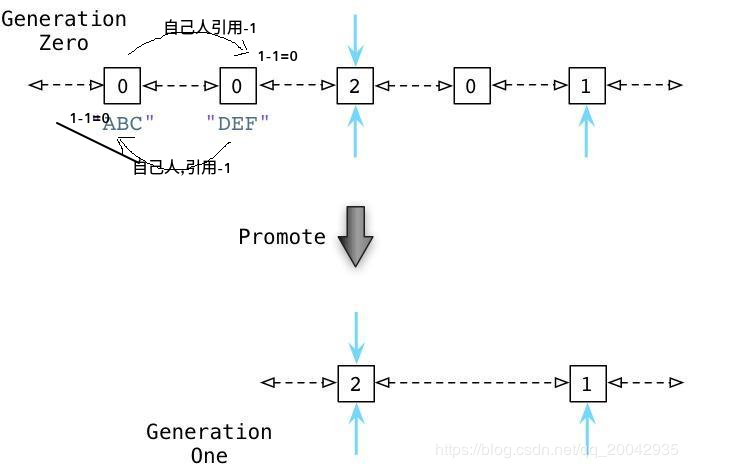

# python进阶18垃圾回收GC
## 垃圾收集三大手段  
### 一、引用计数（计数器）
Python垃圾回收主要以引用计数为主，分代回收为辅。引用计数法的原理是每个对象维护一个ob_ref，用来记录当前对象被引用的次数，也就是来追踪到底有多少引用指向了这个对象，当发生以下四种情况的时候，该对象的引用计数器+1  
```
对象被创建  a=14
对象被引用  b=a
对象被作为参数,传到函数中   func(a)
对象作为一个元素，存储在容器中   List={a,”a”,”b”,2}
```
与上述情况相对应，当发生以下四种情况时，该对象的引用计数器-1  
```
当该对象的别名被显式销毁时  del a
当该对象的引别名被赋予新的对象，   a=26
一个对象离开它的作用域，例如 func函数执行完毕时，函数里面的局部变量的引用计数器就会减一（但是全局变量不会）
将该元素从容器中删除时，或者容器被销毁时。
```
.当指向该对象的内存的引用计数器为0的时候，该内存将会被Python虚拟机销毁  
优点：  
```
高效
运行期没有停顿 可以类比一下Ruby的垃圾回收机制，也就是 实时性：一旦没有引用，内存就直接释放了。不用像其他机制等到特定时机。实时性还带来一个好处：处理回收内存的时间分摊到了平时。
对象有确定的生命周期
易于实现
```
原始的引用计数法也有明显的缺点：  
```
维护引用计数消耗资源，维护引用计数的次数和引用赋值成正比，而不像mark and sweep等基本与回收的内存数量有关。
无法解决循环引用的问题。A和B相互引用而再没有外部引用A与B中的任何一个，它们的引用计数都为1，但显然应该被回收。
```

### 二、标记-清除（双向链表）
『标记清除（Mark—Sweep）』算法是一种基于追踪回收（tracing GC）技术实现的垃圾回收算法。它分为两个阶段：第一阶段是标记阶段，GC会把所有的『活动对象』打上标记，第二阶段是把那些没有标记的对象『非活动对象』进行回收。  
那么GC又是如何判断哪些是活动对象哪些是非活动对象的呢？  
对象之间通过引用（指针）连在一起，构成一个有向图，对象构成这个有向图的节点，而引用关系构成这个有向图的边。从根对象（root object）出发，沿着有向边遍历对象，可达的（reachable）对象标记为活动对象，不可达的对象就是要被清除的非活动对象。根对象就是全局变量、调用栈、寄存器。  
  
在上图中，我们把小黑圈视为全局变量，也就是把它作为root object，从小黑圈出发，对象1可直达，那么它将被标记，对象2、3可间接到达也会被标记，而4和5不可达，那么1、2、3就是活动对象，4和5是非活动对象会被GC回收。  
```
标记清除算法作为Python的辅助垃圾收集技术主要处理的是一些容器对象，比如list、dict、tuple，instance等，因为对于字符串、数值对象是不可能造成循环引用问题。Python使用一个双向链表将这些容器对象组织起来。不过，这种简单粗暴的标记清除算法也有明显的缺点：清除非活动的对象前它必须顺序扫描整个堆内存，哪怕只剩下小部分活动对象也要扫描所有对象。
```
检测循环引用  
随后，Python会循环遍历零代列表上的每个对象，检查列表中每个互相引用的对象，根据规则减掉其引用计数。在这个过程中，Python会一个接一个的统计内部引用的数量以防过早地释放对象。   
  
大多数情况下，循环引用计数其实都是>1的，所以-1后其实也>0，因为其大概率不止有一个指针，可能会指向多个地址，指向的多个地址中~~~~有一个地址被循环引用外的元素引用（**也即是说此元素是真正被需要的，非互相循环导致的假需求**），就不会导致计数器为0  
### 三、分代回收
为了便于理解，来看一个例子：  
  


从而被分配对象的计数值与被释放对象的计数值之间的差异在逐渐增长。一旦这个差异累计超过某个阈值（**说白了就是0代留存量超过阈值，0代链表长度超过阈值**），则Python的收集机制就启动了，并且触发上边所说到的零代算法，释放“浮动的垃圾”，并且将剩下的对象移动到一代列表。  
而Python对于一代列表中对象的处理遵循同样的方法，一旦被分配计数值与被释放计数值累计到达一定阈值，Python会将剩下的活跃对象移动到二代列表。  
通过不同的阈值设置，Python可以在不同的时间间隔处理这些对象。Python处理零代最为频繁，其次是一代然后才是二代。  

## 垃圾收集何时进行?
__del__ 仅在参考计数达到0时执行  

## 为什么定义了__del__的循环引用对象在Python中无法收集
从gc.garbage的文档中：  
Python不会自动收集此类循环，因为通常来说，Python不可能猜测出运行__del__()方法的安全顺序 。如果您知道安全订单，则可以通过检查垃圾清单并由于清单中的对象而明确中断周期来强制执行此问题。  

简单来说，**gc会计算出循环引用的计数器=0，所以会尝试回收，但是由于自定义了__del__方法（重写了obj的__del__），所以就会懵逼，不知道从循环的哪里下口**。除非必要，**否则别重写__del__**，至于__del__中只有pass的就更没必要了.  


## 代码测试
我们知道了python对于垃圾回收，采取的是引用计数为主，标记-清除+分代回收为辅的回收策略。对于循环引用的情况，一般的自动垃圾回收方式肯定是无效了，这时候就需要显式地调用一些操作来保证垃圾的回收和内存不泄露。这就要用到python内建的垃圾回收模块gc模块了。  
```
import sys
import gc

a = [1]
b = [2]
a.append(b)
b.append(a)
####此时a和b之间存在循环引用####
sys.getrefcount(a)    #结果应该是3
sys.getrefcount(b)    #结果应该是3
del a
del b
####删除了变量名a，b到对象的引用，此时引用计数应该减为1，即只剩下互相引用了####
try:
    sys.getrefcount(a)
except UnboundLocalError:
     print 'a is invalid'
####此时，原来a指向的那个对象引用不为0，python不会自动回收它的内存空间####
####但是我们又没办法通过变量名a来引用它了，这就导致了内存泄露####
unreachable_count = gc.collect()
####gc.collect()专门用来处理这些循环引用，返回处理这些循环引用一共释放掉的对象个数。这里返回是2####
```
可以看到，没有gc模块的时候，我们对循环引用是束手无策的，在调用了一些gc模块的方法之后，它会实现上面“垃圾回收机制”部分中提到的一些策略比如“标记-清除”来进行垃圾回收。因为有了这个模块的封装，我们就不用关心具体的实现了。  

然而collect方法也不是万能的。有些时候它并不能有效地回收所有该回收的对象。比如下面这样一段代码：  
```
class A():
  def __init__(self):
    pass
  def __del__(self):
    pass

class B():
  def __init__(self):
    pass
  def __del__(self):
    pass

a = A()
b = B()
a._b = b
b._a = a
del a
del b

print gc.collect()    #结果是4
print gc.garbage    #结果是[<__main__.A instance at 0x0000000002296448>, <__main__.B instance at 0x0000000002296488>]
```
　可以看到，对我们自定义类的对象而言，collect方法并不能解决循环引用引起的内存泄露，即使在collect过后，解释器中仍然存在两个垃圾对象。  
　　这里需要明确一下，之前对于“垃圾”二字的定义并不是很明确，在这里的这个语境下，垃圾是指在经过collect的垃圾回收之后仍然保持unreachable状态，即无法被回收，且无法被用户调用的对象应该叫做垃圾。gc模块中有garbage这个属性，其为一个列表，每一项都是当前解释器中存在的垃圾对象。一般情况下，这个属性始终保持为空集。  
　　那么为什么在这种场景下collect不起作用了呢？这主要是因为我们在类中重载了__del__方法。__del__方法指出了在用del语句删除对象时除了释放内存空间以外的操作。一般而言，在使用了del语句的时候解释器会首先看要删除对象的引用计数，如果为0，那么就释放内存并执行__del__方法。在这里，首先del语句出现时本身引用计数就不为0（因为有循环引用的存在），所以解释器不释放内存；再者，执行collect方法时照理由应该会清除循环引用所产生的无效引用计数从而达到del的目的，对于这两个对象而言，python无法判断调用它们的__del__方法时会不会要用到对方那个对象，比如在进行b._ _del__ ()时可能会用到b._a也就是a，如果在那之前a已经被释放，那么就彻底GG了。为了避免这种情况，collect方法默认不对重载了__del__方法的循环引用对象进行回收，而它们俩的状态也会从unreachable转变为uncollectable。由于是uncollectable的，自然就不会被collect处理，所以就进入了garbage列表。  
　　collect返回4的原因是因为，在A和B类对象中还默认有一个__dict__属性，里面有所有属性的信息。比如对于a，有a. __ dict __  = {'_b':< __main__ .B instance at xxxxxxxx>}。a的__dict__和b的__dict__也是循环引用的。但是字典类型不涉及自定义的__del__方法，所以可以被collect掉。所以garbage里只剩下两个了。  
　　有时候garbage里也会出现那两个__dict__，这主要是因为在前面可能设置了gc模块的debug模式，比如gc.set_debug(gc.DEBUG_LEAK)，会把所有已经回收掉的unreachable的对象也都加入到garbage里面。set_debug还有很多参数诸如gc.DEBUG_STAT|DEBUG_COLLECTABLE|DEBUG_UNCOLLECTABLE|DEBUG_SAVEALL等等，设置了相关参数后gc模块会自动检测垃圾回收状况并给出实时地信息反映。  
  
 gc.get_threshold()  
　　这个方法涉及到之前说过的分代回收的策略。python中默认把所有对象分成三代。第0代包含了最新的对象，第2代则是最早的一些对象。在一次垃圾回收中，所有未被回收的对象会被移到高一代的地方。  
　　这个方法返回的是(700,10,10)，这也是gc的默认值。这个值的意思是说，在第0代对象数量达到700个之前，不把未被回收的对象放入第一代；而在第一代对象数量达到10个之前也不把未被回收的对象移到第二代。可以是使用gc.set_threshold(threashold0,threshold1,threshold2)来手动设置这组阈值。  

## 参考
【Python】 垃圾回收机制和gc模块:https://www.cnblogs.com/franknihao/p/7326849.html  
Python垃圾回收机制详解：https://blog.csdn.net/xiongchengluo1129/article/details/80462651   
__del__的几个坑:https://blog.csdn.net/pirDOL/article/details/51586406  
涉及循环引用时__del__方法未执行:https://www.pythonheidong.com/blog/article/398409/  
为什么定义了__del__的循环引用对象在Python中无法收集？：https://www.pythonheidong.com/blog/article/141888/  


