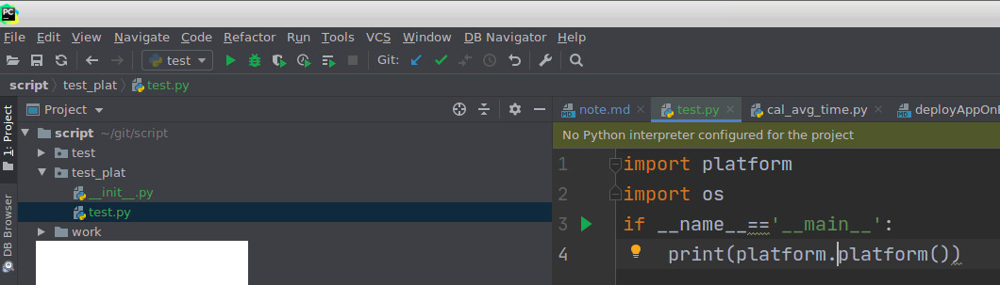
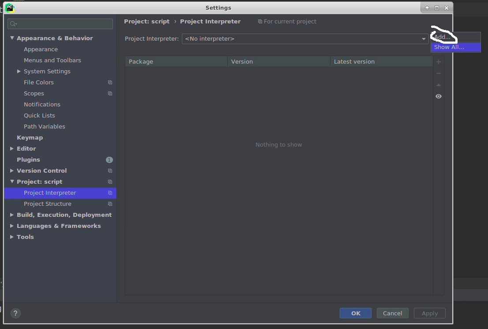
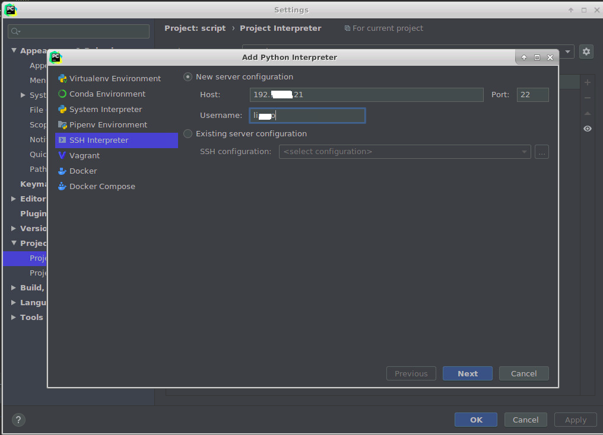
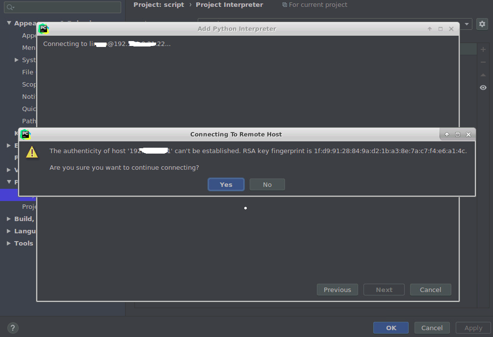
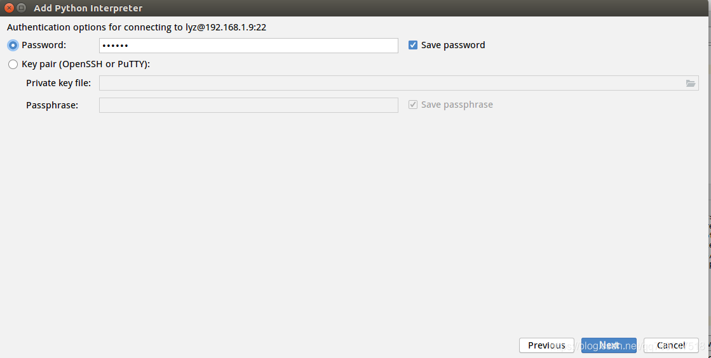
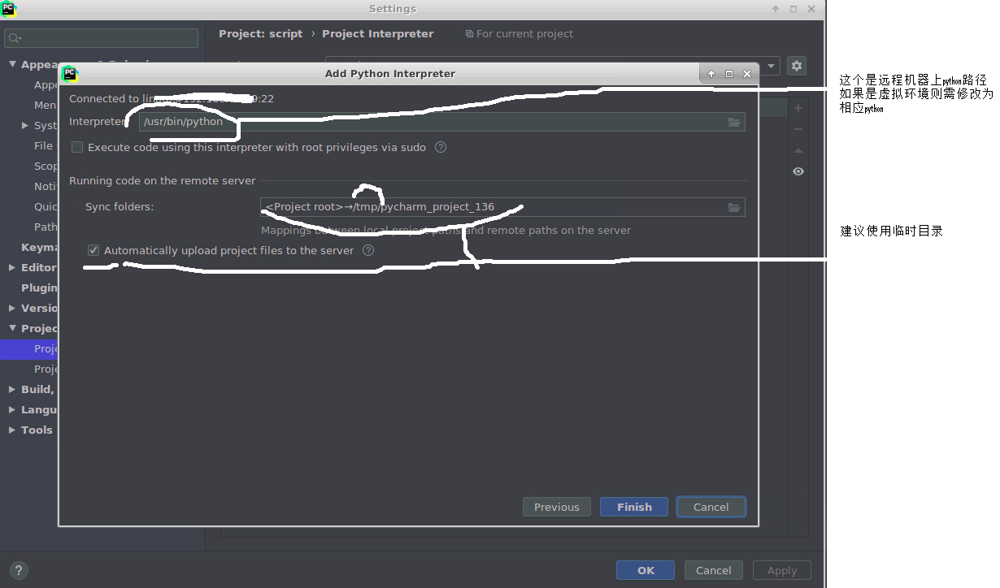
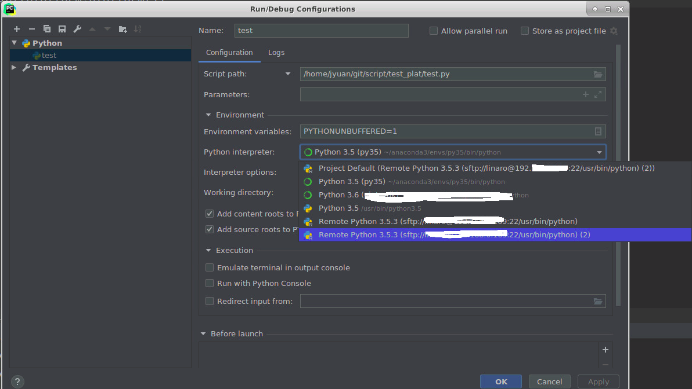
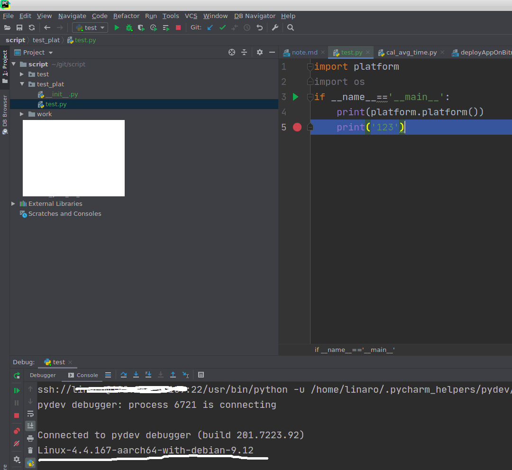

# python进阶27远程接口调试
需要将项目部署到armbox上，但是发现arm上调试非常繁琐。由于没有图形界面，所以无法使用pycharm工具，只能在终端中执行python命令，然后通过pdb进行调试。对于单线程尚无问题，但是对于web等多线程项目，pdb就无法进行调试了。  
之前做java时曾用过远程调试，查了下，pycharm其实也有这个功能。当然必须是专业版，免费版是不行的。  

## 原始代码：打印所属平台信息  
  

## 添加Python Interpreter  
  

## 添加ssh interpreter连接信息   
  

## ssh interpreter密码信息  
这里大多数都会显示输入密码信息，本人这里是由于已经建立了免密的ssh连接，所以没有弹出密码框。  
  

弹出密码样式  
  

## interpreter配置信息  
  

## 修改执行代码的interpreter   
  

## 验证结果正确  
  

## 参考
PyCharm远程开发调试:https://blog.csdn.net/yejingtao703/article/details/80292486  
SSH 三步解决免密登录：https://blog.csdn.net/jeikerxiao/article/details/84105529  
ssh隧道解决pycharm跨过跳板机连接服务器问题：https://blog.csdn.net/huangbx_tx/article/details/93339715  